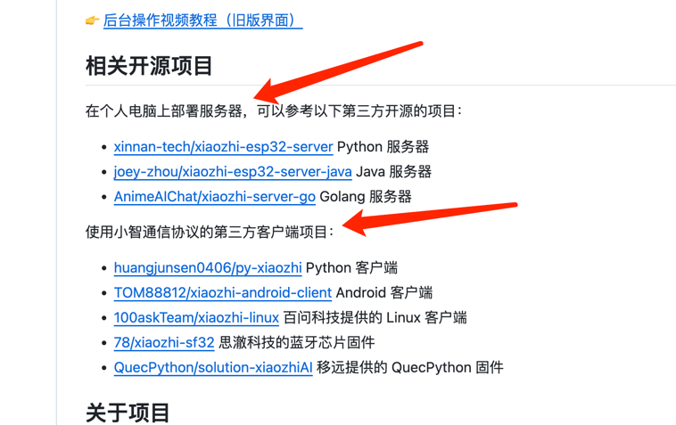

# 游乐园（开发中)

## 项目概述

这是一个面向儿童的沉浸式乐园互动系统，通过 AI Agent 与用户（小朋友）进行语音对话，结合手环打卡设备与任务奖励机制，为每位游客生成独特的游戏体验与故事线。


## Agent 控制机制

### Agent 的生命周期管理

Agent 在项目中的实现基于 **ConnectionHandler** 机制，每个 WebSocket 连接对应一个独立的 Agent 实例。

#### 1. Agent 的创建与初始化

**触发时机**:
- 用户首次连接 WebSocket 时（通过 `device-id` 和 `client-id` 标识）
- 用户到达打卡点，前端建立 WebSocket 连接

**初始化流程** (`tour_backend/core/connection.py`):

```python
# 1. 创建 ConnectionHandler 实例
handler = ConnectionHandler(config, _vad, _asr, _llm, _memory, _intent, server)

# 2. 处理连接（handle_connection）
- 获取并验证 headers（device-id, client-id）
- 初始化活动时间戳
- 启动超时检查任务

# 3. 获取差异化配置（_initialize_private_config）
- 如果启用 read_config_from_api，从管理 API 获取该设备/NPC 的专属配置
- 调用 get_agent_models(device_id, client_id) 获取 Agent 模型配置
- 配置包括：LLM、TTS、Memory、Intent、prompt 等

# 4. 初始化组件（_initialize_components）
- 初始化 VAD、ASR、TTS（每个连接独立实例）
- 初始化 LLM、Memory、Intent（根据配置创建）
- 加载系统提示词（prompt），定制 Agent 行为
- 初始化记忆模块（从历史对话中恢复上下文）
```

#### 2. Agent 的配置管理

**配置来源优先级**:
1. **管理 API 动态配置** (`tour_backend/config/manage_api_client.py`):
   - 通过 `get_agent_models(device_id, client_id)` 获取
   - 每个设备/NPC 可以有独立的 LLM、TTS、Memory 配置
   - 支持实时更新配置（热重载）

2. **本地配置文件** (`tour_backend/config.yaml`):
   - 默认配置，用于开发测试
   - 优先级低于 API 配置

**配置内容**:
- `prompt`: 系统提示词，定义 Agent 的角色、性格、行为规则
- `LLM`: 大语言模型配置（OpenAI、通义千问、Gemini 等）
- `TTS`: 语音合成配置（Edge TTS、Azure 等）
- `Memory`: 记忆管理配置（Mem0、本地短记忆等）
- `Intent`: 意图识别配置（function_call、intent_llm 等）

#### 3. Agent 的对话处理

**对话流程** (`tour_backend/core/connection.py` 的 `chat` 方法):

```python
# 1. 接收用户输入（文本或语音转文字）
query = "用户说的话"

# 2. 查询记忆（如果有 Memory 模块）
memory_str = memory.query_memory(query)

# 3. 构建对话上下文
dialogue = dialogue.get_llm_dialogue_with_memory(memory_str)

# 4. 调用 LLM 生成回复
llm_responses = llm.response(session_id, dialogue)

# 5. 处理工具调用（如果 LLM 决定调用工具）
if tool_call:
    result = func_handler.handle_llm_function_call(function_call_data)
    # 根据结果决定是直接回复还是再次调用 LLM

# 6. 生成 TTS 音频并发送给客户端
tts.tts_one_sentence(content)

# 7. 保存对话到记忆
memory.save_memory(dialogue)
```

#### 4. 多 Agent 管理

**Agent 标识**:
- 通过 `device-id`（设备 ID，通常是 NPC 的设备标识）区分不同的 Agent
- 通过 `client-id`（客户端 ID，通常是用户 ID）区分同一 Agent 的不同会话

**Agent 实例管理**:
- `WebSocketServer` 维护 `active_connections` 集合
- 每个连接对应一个 `ConnectionHandler`（即一个 Agent 实例）
- 支持同一设备多个用户同时连接（多会话）

**Agent 状态同步**:
- 对话历史通过 Memory 模块持久化
- 支持从管理 API 上报对话记录（`/agent/chat-history/report`）
- 记忆总结通过 `save_mem_local_short` 保存到服务器

#### 5. Agent 的销毁

**销毁时机**:
- 用户主动断开 WebSocket 连接
- 连接超时（默认 120 秒无活动后关闭）
- 用户结束对话或长时间不使用

**销毁流程** (`close` 方法):

```python
# 1. 保存记忆（异步，不阻塞）
memory.save_memory(dialogue)

# 2. 清理资源
- 关闭 TTS 音频通道
- 关闭 ASR 音频通道
- 清理工具处理器（func_handler.cleanup()）
- 清空所有任务队列
- 关闭线程池

# 3. 关闭 WebSocket 连接
await websocket.close()
```

#### 6. Agent 控制的关键接口

**管理 API 接口** (`manage_backend/app/routers/agent.py`):
- `POST /api/admin/agent/generate`: AI 生成故事与任务模板

**配置获取接口** (`tour_backend/config/manage_api_client.py`):
- `POST /config/agent-models`: 获取 Agent 模型配置（LLM、TTS、Memory 等）
- `PUT /agent/saveMemory/{mac_address}`: 保存 Agent 记忆
- `POST /agent/chat-history/report`: 上报对话记录

**OTA 接口** (`tour_backend/core/http_server.py`):
- `POST /xiaozhi/ota/`: 设备配置下发，返回 WebSocket 地址和 Token

### Agent 控制的最佳实践

1. **为每个 NPC 创建独立的 Agent 配置**:
   - 在管理后台为每个 NPC 配置独立的 `device-id`
   - 为每个 NPC 设置不同的 `prompt`（角色设定、性格、背景故事）
   - 可以为不同 NPC 选择不同的 LLM 模型（性能 vs 成本）

2. **用户绑定角色后初始化 Agent**:
   - 用户首次连接时，通过 `device-id` 和 `client-id` 获取专属配置
   - Agent 自动加载该用户的对话历史（Memory）
   - 根据用户的任务进度调整 Agent 的对话内容

3. **跨打卡点的 Agent 状态保持**:
   - 通过 Memory 模块保存对话历史
   - 用户在不同打卡点连接时，Agent 可以访问之前的对话记录
   - 实现连续的故事线和任务进度跟踪

4. **Agent 的个性化定制**:
   - 通过 `prompt` 定制 Agent 的性格、说话风格、知识范围
   - 通过 `Intent` 配置 Agent 可以调用的工具和功能
   - 通过 `Memory` 配置 Agent 的记忆能力和上下文长度


## 子项目代码逻辑简介

### 1. manage_backend - 管理后台 API

**技术栈**: FastAPI + SQLAlchemy + MySQL

**核心功能**:
- 提供游戏主题、NPC、任务、打卡点等管理功能的 RESTful API
- JWT Token 认证机制，支持管理员权限控制
- 数据库 ORM 模型管理（玩家、主题、NPC、任务、奖励等）
- AI 故事生成服务（调用 LLM 生成故事和任务模板）
- 审计日志中间件，记录所有写操作

**代码逻辑**:
- 入口文件 `app/main.py` 创建 FastAPI 应用，配置 CORS、注册路由、启动时自动创建数据库表
- 认证通过 `app/deps.py` 的依赖注入实现，`get_current_admin` 验证管理员权限
- 数据验证使用 Pydantic Schemas（`app/schemas.py`）
- 所有 API 路由统一前缀 `/api/admin`

详细文档: [manage_backend/README.md](manage_backend/README.md)

### 2. manage_frontend - 管理后台前端

**技术栈**: Next.js 13 + TypeScript + TailwindCSS + Radix UI

**核心功能**:
- 游戏主题管理（增删改查）
- NPC 角色配置
- 任务模板管理
- 打卡点配置
- 用户管理、奖励设置、数据统计

**代码逻辑**:
- 使用 Supabase 客户端直接连接数据库（而非通过后端 API）
- 认证通过 React Context 管理，Token 存储在 `sessionStorage`
- 路由保护：未登录自动跳转到登录页
- 管理后台布局：左侧固定侧边栏 + 右侧内容区域

详细文档: [manage_frontend/README.md](manage_frontend/README.md)

### 3. tour_backend - 语音助手后端服务

**技术栈**: Python + WebSocket + 异步处理

**核心功能**:
- WebSocket 实时语音对话服务
- 语音识别（ASR）、大语言模型对话（LLM）、语音合成（TTS）
- 语音活动检测（VAD）、意图识别、记忆管理
- 支持多种 ASR/LLM/TTS 提供商（阿里云、百度、OpenAI、通义千问等）
- MCP 工具调用、插件系统

**代码逻辑**:
- `app.py` 启动 WebSocket 服务器和 HTTP 服务器（OTA 接口）
- `core/websocket_server.py` 管理 WebSocket 连接，为每个连接创建独立的 `ConnectionHandler`
- `core/connection.py` 处理每个连接的完整生命周期：初始化组件、处理音频/文本消息、管理对话状态
- 模块化架构：根据配置动态加载 VAD、ASR、LLM、TTS、Memory、Intent 模块
- 支持从管理 API 动态获取差异化配置（每个设备/NPC 可独立配置）

详细文档: [tour_backend/README.md](tour_backend/README.md)

### 4. tour_frontend - 游客交互前端

**技术栈**: Next.js + TypeScript + TailwindCSS（开发中）

**核心功能**:
- 打卡识别界面（手环识别成功后显示欢迎动画）
- NPC 对话界面（实时语音对话、对话气泡展示）
- 任务与奖励展示
- 下一步引导（地图简图、方向箭头）

**代码逻辑**:
- 通过 OTA 接口获取 WebSocket 地址和配置
- 建立 WebSocket 连接，实现实时语音对话
- 使用 VAD 检测自动开始/停止录音
- 音频处理：Opus 编码/解码，16kHz 单声道
- 对话历史持久化到 Supabase

详细文档: [tour_frontend/README.md](tour_frontend/README.md)

### 5. xiaozhi_web - 小智 Web 前端

**技术栈**: Next.js 13 + TypeScript + Web Audio API

**核心功能**:
- Web 端语音助手客户端
- 通过 WebSocket 与后端语音服务连接
- 实时语音对话（VAD 检测、音频录制、播放）

**代码逻辑**:
- `lib/application.ts` 单例模式管理应用状态
- `lib/protocols/websocket-protocol.ts` 处理 WebSocket 通信协议
- `hooks/use-advanced-vad.ts` 使用 Silero VAD 模型检测语音活动
- `lib/opus.ts` 处理 Opus 音频编码/解码
- 通过 OTA 接口获取配置，建立 WebSocket 连接

详细文档: [xiaozhi_web/README.md](xiaozhi_web/README.md)

### 6. xiaozhi-webui - 小智 WebUI（Vue3 版本）

**技术栈**: Vue3 + TypeScript + Python FastAPI（代理后端）

**核心功能**:
- Vue3 实现的语音助手 Web 端
- Python 代理后端作为前端和 tour_backend 之间的中间层
- 状态机管理对话状态（IDLE / USER_SPEAKING / AI_SPEAKING）

**代码逻辑**:
- 三层架构：前端（Vue3） ↔ 代理后端（Python） ↔ tour_backend
- `backend/app/proxy/websocket_proxy.py` 处理音频格式转换（PCM ↔ Opus）
- `src/services/ChatStateManager.ts` 状态机管理对话流程
- `src/services/AudioManager.ts` 使用 AudioWorklet 处理音频数据

详细文档: [xiaozhi-webui/README.md](xiaozhi-webui/README.md)


## 支持的语音框架
1. TEN Framework  (声网，收费，免费10000分钟)   Ten --> 声网 --> 电脑
2. Livekit   （国外，收费）
3. fastrtc   (Huggingface 团队)， 部署到公网服务器即可。

## 不同语音模式
Realtime 模式： (端到端模式，Agent效果比较差，工具比较差，速度快，流畅，闲聊功能好)
pipeline模式： STT +GLM(Agent) +TTS （可控，速度慢，延迟1秒以内）

Realtime: 角色声音，不好控制，因为是端到端的。
TTS：可定制角色声音。

GLM(Agent) 实现方式：Google ADK, LangGraph React Agent, Openai Agents. 实现记忆，多Agent。
对比GLM Agent，更可控，多Agent串联。

## 实现思路
### 这是FastRTC的实现，但是很卡，不知道为什么
[backend](tour_backend/backend)
[frontend](tour_backend/frontend)


### 参考小智
小智的客户端和服务端。
https://github.com/78/xiaozhi-esp32
只需要使用main/xiaozhi-server的部分
https://github.com/huangjunsen0406/py-xiaozhi


## SenseVoice模型下载:
https://modelscope.cn/models/iic/SenseVoiceSmall/resolve/master/model.pt
放到tour_backend/models/SenseVoiceSmall/model.pt

修改配置文件
```
tour_backend/data/.config.yaml
```

## 配置和启动
```
查看：
cd tour_backend
python3 -m pip install -r requirements.txt
python3 app.py

浏览器打开： tour_backend/test/test_page.html
```


## 这里可以添加自定义的API
```
tour_backend/core/api
base_handler.py
ota_handler.py
vision_handler.py
```